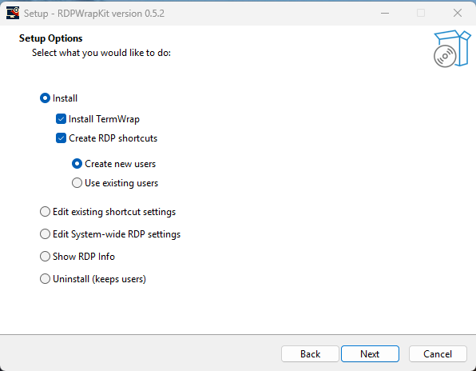
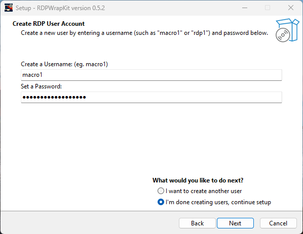
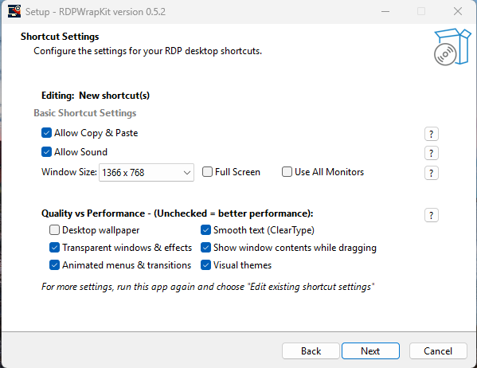
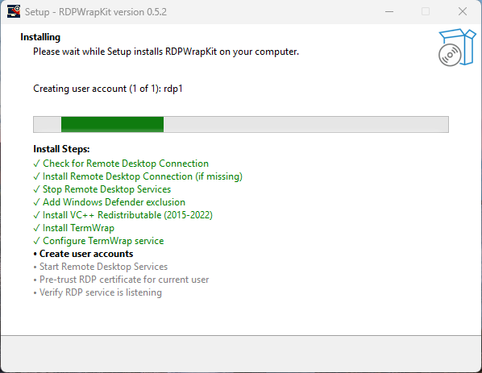
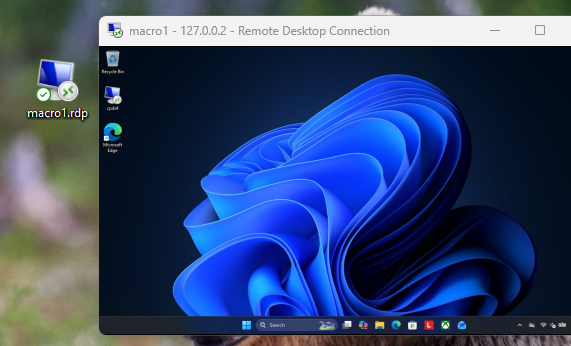

# RDPWrapKit

### The all-in-one installer for local RDP setup

**Problem:** Local RDP setups are complex, prone to errors, and require upkeep.  
**Solution:** RDPWrapKit bundles the community's best tools into a single installer that just works.

---

## No more Guesswork

Everything bundled into one setup with no manual steps, no headaches.

| | |
|---|---|
| ✅ **Local RDP for everyone** — What used to take 60 minutes **now takes 60 seconds** | ✅ **Seamless Updates** — Stays up to date automatically, no file editing needed (even after Windows Updates) · [Powered by TermWrap](https://github.com/llccd/TermWrap) |
| ✅ **User Creation** — Optionally add user accounts during setup for instant RDP access | ✅ **Fewer Headaches** — Proactively identifies and auto-fixes common RDP misconfigurations |
| ✅ **Quick Desktop Access** — Creates ready-to-use RDP shortcuts on your desktop automatically | ✅ **Fully Transparent** — Open-source Inno Setup code is public. See exactly what it does |

---

## 60-second installation

| Step 1: Setup Options | Step 2: Create RDP User |
|---|---|
|  |  |
| Choose the defaults (Install and Create RDP shortcuts) for new installs | Create a dedicated RDP user account during installation |

| Step 3: Shortcut Settings | Step 4: Installation Complete |
|---|---|
|  |  |
| Configure your RDP shortcut settings | Installation is complete. Restart if prompted |

| Step 5: Desktop Shortcuts |
|---|
|  |
| Ready-to-use RDP shortcuts appear on your desktop after setup |

---

## Quick Start

Three simple steps to a working local RDP setup.

**01 — Download RDPWrapKit**

[⬇ Download RDPWrapKit-Setup.exe](https://github.com/cpdx4/RDPWrapKit/releases/latest/download/RDPWrapKit-Setup.exe)

> Your browser or antivirus might require an allow action. It is virus-free.

**02 — Run the Installer**

Run setup and choose **Typical Setup** for new installs.

> This installs TermWrap, creates users, and configures everything. Restart your PC if prompted.

**03 — Connect**

Open the new desktop RDP shortcut to begin using RDP.

> Re-run Setup if you need to make changes to your shortcuts.

---

## Support / Contact

> There is no implied warranty and unexpected results might occur.

Have a question, found a bug, or want to request an enhancement? Open an [issue](https://github.com/cpdx4/RDPWrapKit/issues) on this repository.

---

## Credits

- RDPWrapKit builds on the fantastic work of [TermWrap](https://github.com/llccd/TermWrap), which was inspired by [RDPWrapper](https://github.com/stascorp/rdpwrap/releases)
- Bee Swarm Simulator communities: [BSGH](https://discord.gg/bsgh) and [BSS Grinders](https://discord.gg/K5U3RdGXh6)

---

## Build from Source

> Advanced — not required for most people.

**01 — Install Inno Setup and download the source**

Install [Inno Setup](https://github.com/jrsoftware/issrc/releases) and download the [Source Code](https://github.com/cpdx4/RDPWrapKit/archive/refs/heads/main.zip).

**02 — Open and Compile**

Open `RDPWrapKit.iss` in the Inno Setup Compiler, then press `F9` or use the Compile button.

> The generated installer will appear in the `output/` folder.
