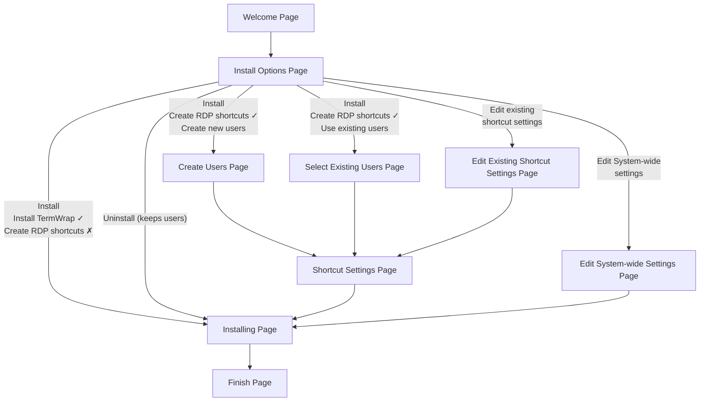

# RDPWrapKit Installer — User Flow & Install Modes

## Installer Page Flow (Mermaid Diagram)

Below is a detailed flowchart of the RDPWrapKit installer wizard pages and user navigation, covering all install modes and decision points.



### Page Descriptions

- **Welcome Page**: Shows credits, project links, and a brief intro.
- **Install Options**: User selects the desired install mode via radio buttons, with conditional sub-options for the Install mode.
- **Create Users Page**: Add new local users and set passwords for RDP access (shown only when Install + Create RDP shortcuts + Create new users is selected).
- **Select Existing Users Page**: Pre-populated list of local users with password fields; user selects which to generate shortcuts for (shown only when Install + Create RDP shortcuts + Use existing users is selected).
- **Edit Existing Shortcut Settings Page**: List of .rdp files on the Desktop; user selects one to modify or delete (shown only in Edit existing shortcut settings mode).
- **Shortcut Settings Page**: Configure RDP session options (resolution, full screen, audio, clipboard, etc.) for shortcuts being created or edited.
- **Edit System-wide Settings Page**: Change RDP port, enable/disable RDP, show users on login screen, prevent duplicate sessions, etc. (shown only in system settings mode).
- **Installing**: Shows progress indicators and step-by-step status of each operation.
- **Finish Page**: Summary of completed actions, links, and option to view the install log.

---

## Install Mode Architecture

The installer has **four top-level modes**, selected via radio buttons on the Options page. The Install mode is further controlled by two boolean flags and one integer enum:

| Mode Constant | Flags | Description | Pages Shown |
|---|---|---|---|
| **`installModeInstall`** | `DoInstallTermWrap=T, DoCreateRdpShortcuts=F` | **Path A**: Install TermWrap only | Welcome → Options → Installing → Finish |
| | `DoCreateRdpShortcuts=T, CreateUserMode=createUserModeNew` | **Path B**: Create new users + shortcuts (TermWrap optional) | Welcome → Options → UserPage → ShortcutSettings → Installing → Finish |
| | `DoCreateRdpShortcuts=T, CreateUserMode=createUserModeExisting` | **Path C**: Use existing users + shortcuts (TermWrap optional) | Welcome → Options → ExistingUsers → ShortcutSettings → Installing → Finish |
| **`installModeEditShortcuts`** | — | Edit, modify, or remove existing .rdp shortcuts | Welcome → Options → EditShortcuts → ShortcutSettings → Installing → Finish |
| **`installModeEditSystemwideSettings`** | — | Change RDP port, enable/disable RDP, login display, etc. | Welcome → Options → EditSystemwideSettings → Installing → Finish |
| **`installModeUninstall`** | — | Removes TermWrap components and shortcuts; user accounts are kept | Welcome → Options → Installing → Finish |

### Key Variables

| Variable | Type | Values |
|---|---|---|
| `SelectedInstallMode` | `Integer` | `installModeInstall`, `installModeEditShortcuts`, `installModeEditSystemwideSettings`, `installModeUninstall` |
| `DoInstallTermWrap` | `Boolean` | `True` = install TermWrap binaries; `False` = skip |
| `DoCreateRdpShortcuts` | `Boolean` | `True` = create .rdp shortcut files; `False` = skip |
| `CreateUserMode` | `Integer` | `createUserModeNew` (0) = create new accounts; `createUserModeExisting` (1) = use existing accounts |

`CreateUserMode` is only meaningful when `DoCreateRdpShortcuts = True`.

---

## Options Page: Mode Selection Flow

1. **Welcome Page**: Displays project info and credits.
2. **Options Page**: User selects one of the four install modes via radio buttons.
   - If **"Install"** is selected, two additional controls appear:
     - `chkInstallTermWrap` (default: checked) — Install TermWrap binaries → sets `DoInstallTermWrap`
     - `chkCreateRdpShortcuts` — **"Create RDP shortcuts"** (default: unchecked) → sets `DoCreateRdpShortcuts`
     - If **"Create RDP shortcuts"** is checked, a radio group appears:
       - `rbCreateUsers` — **"Create new users"** → sets `CreateUserMode = createUserModeNew`
       - `rbUseExistingUsers` — **"Use existing users"** → sets `CreateUserMode = createUserModeExisting`
3. **Mode-Specific Pages**: Based on selections, relevant pages are shown or skipped.
4. **Installing Page**: All flows converge here to execute the selected operations.
5. **Finish Page**: Final summary and log access.

### Options Page Navigation Logic (Internal Decision Tree)

When the user clicks Next on the Options page, the installer evaluates selections in this order:

```
1. Is "Uninstall (keeps users)" selected?
   └─ YES: SelectedInstallMode = installModeUninstall

2. Is "Edit System-wide settings" selected?
   └─ YES: SelectedInstallMode = installModeEditSystemwideSettings
           DoEditSystemWideSettings = True

3. Is "Edit existing shortcut settings" selected?
   └─ YES: SelectedInstallMode = installModeEditShortcuts
           (loads .rdp file list from Desktop)

4. Otherwise "Install" is selected:
   └─ SelectedInstallMode = installModeInstall
      DoInstallTermWrap    = chkInstallTermWrap.Checked
      DoCreateRdpShortcuts = chkCreateRdpShortcuts.Checked
      If DoCreateRdpShortcuts:
        ├─ rbCreateUsers selected     → CreateUserMode = createUserModeNew
        └─ rbUseExistingUsers selected → CreateUserMode = createUserModeExisting
      Validation: At least one of DoInstallTermWrap or DoCreateRdpShortcuts must be True.
```

**Note:** All Install sub-flows share `installModeInstall`. Behavior is driven entirely by `DoInstallTermWrap`, `DoCreateRdpShortcuts`, and `CreateUserMode`.

---

## Detailed Installation Flows by Mode

### Mode: Install (`installModeInstall`) — Three Sub-paths

**Purpose**: Installation of TermWrap and/or RDP shortcut management.

`DoInstallTermWrap` and `DoCreateRdpShortcuts` can be combined in any way (except both False, which is rejected with a validation error). This gives three meaningful sub-paths:

#### Path A: Install TermWrap ONLY

```
Welcome → Options → Installing → Finish
```

**Options page selections**:
- `chkInstallTermWrap` ✓ checked
- `chkCreateRdpShortcuts` ✗ unchecked

**Installation Steps**:
1. Check MSTSC version
2. Install MSTSC (if needed)
3. Stop RDP service
4. Add Defender exclusion
5. Install VC++ Redistributable (if needed)
6. Install TermWrap components
7. Configure RDP service
8. Start RDP service
9. Pre-trust RDP certificate for current user
10. Verify RDP is listening

---

#### Path B: Install + Create RDP shortcuts + Create new users

```
Welcome → Options → UserPage → ShortcutSettings → Installing → Finish
```

**Options page selections**:
- `chkCreateRdpShortcuts` ✓ checked
- `rbCreateUsers` selected

**User Actions**:
1. Add one or more new local user accounts with passwords
2. Configure RDP shortcut settings (resolution, display mode, audio, clipboard)

**Installation Steps** (when `DoInstallTermWrap = True`):
1. Check/Install MSTSC
2. Stop RDP service
3. Add Defender exclusion
4. Install VC++ Redistributable (if needed)
5. Install TermWrap components
6. Configure RDP service
7. Create each new user account with specified password
8. Generate RDP shortcuts with configured settings
9. Start RDP service
10. Pre-trust RDP certificate for current user
11. Verify RDP is listening

When `DoInstallTermWrap = False`, steps 1–6 and 9–11 are skipped; only user creation and shortcut generation occur.

---

#### Path C: Install + Create RDP shortcuts + Use existing users

```
Welcome → Options → ExistingUsers → ShortcutSettings → Installing → Finish
```

**Options page selections**:
- `chkCreateRdpShortcuts` ✓ checked
- `rbUseExistingUsers` selected

**User Actions**:
1. Select existing local users (checkboxes, with password validation)
2. Configure RDP shortcut settings (resolution, display mode, audio, clipboard)

**Installation Steps** (when `DoInstallTermWrap = True`):
1. Check/Install MSTSC
2. Stop RDP service
3. Add Defender exclusion
4. Install VC++ Redistributable (if needed)
5. Install TermWrap components
6. Configure RDP service
7. Generate RDP shortcuts for selected existing users
8. Start RDP service
9. Pre-trust RDP certificate for current user
10. Verify RDP is listening

When `DoInstallTermWrap = False`, steps 1–6 and 8–10 are skipped; only shortcut generation and pre-trust occur. This is the lightweight path for adding shortcuts to an already-configured machine.

---

### Mode: Edit existing shortcut settings (`installModeEditShortcuts`)

**Purpose**: Modify settings of an existing .rdp shortcut file, or open it in the full Remote Desktop Connection editor.

```
Welcome → Options → EditShortcuts → ShortcutSettings → Installing → Finish
```

**User Actions**:
1. Select an existing .rdp shortcut file from the list (paginated if many)
2. Modify RDP settings (resolution, full screen, audio, clipboard, etc.)
3. Optionally check "Show more options" to open the file in `mstsc /edit` for full editing

**Installation Steps**:
1. Write updated shortcut settings to the selected .rdp file
2. If "Show more options" was checked: open the .rdp file in `mstsc /edit` for further editing (user must click Save on the General tab)

---

### Mode: Edit System-wide settings (`installModeEditSystemwideSettings`)

**Purpose**: Modify system-level RDP configuration without affecting user accounts or shortcut files.

```
Welcome → Options → EditSystemwideSettings → Installing → Finish
```

**User Actions**:
1. View current Windows version and RDP status
2. Enable/Disable RDP (if not a domain controller)
3. Set RDP port number (default: 3389)
4. Show users on login screen (yes/no)
5. Prevent duplicate RDP sessions per user (yes/no)
6. Optionally restart RDP service after applying changes

**Installation Steps**:
1. Apply registry changes for any modified settings (Enable RDP, Show Users, Prevent Duplicate, Port Number)
2. Restart RDP service (if user opted in)

---

### Mode: Uninstall (keeps users) (`installModeUninstall`)

**Purpose**: Remove TermWrap components and generated shortcuts. Local user accounts are preserved.

```
Welcome → Options → Installing → Finish
```

**No further user interaction** after mode selection — all steps run automatically.

**Installation Steps**:
1. Stop RDP service
2. Remove Defender exclusion
3. Remove TermWrap files and folder
4. Start RDP service

---

## Page Visibility Logic (`ShouldSkipPage`)

The installer dynamically shows or skips pages based on the selected mode and flags:

| Page | Shown When | Skipped When |
|---|---|---|
| `UserPage` | `installModeInstall` AND `DoCreateRdpShortcuts = True` AND `CreateUserMode = createUserModeNew` | Any other combination |
| `Page_CreateShortcutsForExistingUsers` | `installModeInstall` AND `DoCreateRdpShortcuts = True` AND `CreateUserMode = createUserModeExisting` | Any other combination |
| `Page_ShortcutSettings` | `installModeInstall` AND `DoCreateRdpShortcuts = True`, OR `installModeEditShortcuts` | All other modes |
| `EditShortcutPage` | `installModeEditShortcuts` only | All other modes |
| `EditSystemwideSettingsPage` | `installModeEditSystemwideSettings` only | All other modes |
| `wpSelectDir` (Inno built-in) | Never | Always skipped |
| `wpReady` (Inno built-in) | Never | Always skipped |

### Page Visibility by Path

**Path A: Install (TermWrap only)**
- UserPage → Skipped
- ExistingUsers → Skipped
- ShortcutSettings → Skipped
- EditShortcuts → Skipped
- EditSystemwideSettings → Skipped
- Installing → Shown ✓

**Path B: Install + Create RDP shortcuts + Create new users**
- UserPage → Shown ✓
- ExistingUsers → Skipped
- ShortcutSettings → Shown ✓
- Installing → Shown ✓

**Path C: Install + Create RDP shortcuts + Use existing users**
- UserPage → Skipped
- ExistingUsers → Shown ✓ (pre-populated with local accounts)
- ShortcutSettings → Shown ✓
- Installing → Shown ✓

**Mode: Edit existing shortcut settings**
- EditShortcuts → Shown ✓
- ShortcutSettings → Shown ✓
- Installing → Shown ✓

**Mode: Edit System-wide settings**
- EditSystemwideSettings → Shown ✓
- Installing → Shown ✓

**Mode: Uninstall (keeps users)**
- Installing → Shown ✓

---

## Notes

- All flows end with the **Finish Page**.
- The installer uses progressive step indicators on the Installing page to show real-time operation progress.
- Directory selection (`wpSelectDir`) and Ready (`wpReady`) pages are always hidden.
- Page skipping is calculated dynamically via `ShouldSkipPage` based on the current variable state.
- The **Shortcut Settings page** is reused across multiple Install sub-paths and the Edit Shortcuts mode.
- **Uninstall keeps local user accounts** — only TermWrap components and generated shortcuts are removed.
- In Path B and Path C, `DoInstallTermWrap` can be `False` — the user can opt to create shortcuts without installing TermWrap (useful when TermWrap is already installed and only shortcuts need updating).
